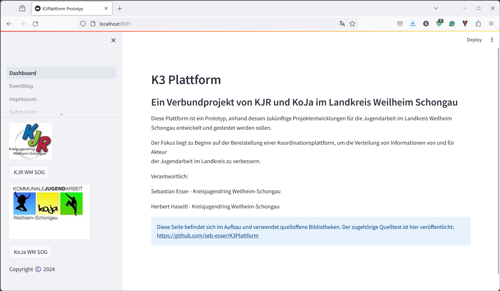

# K3 Verbundprojekt - KJR WM SOG & KoJa Weilheim-Schongau

This repository contains a prototype for a newly developed information deployment platform. 
Its primary objective is to accelerate the information distribution across the Bavarian district Weilheim-Schongau. 

# License

The exact license is not yet decided but it will very likely enable to use our repository in other open-source projects. 
More to come soon!

